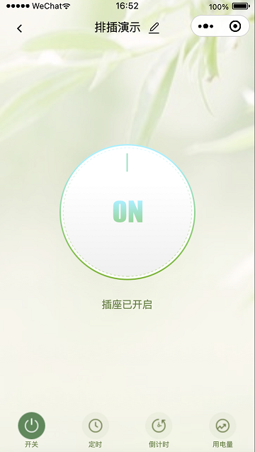

[English](README.md) | [中文版](README_cn.md)

This project is developed using Tuya SDK, which enables you to quickly develop branded apps connecting and controlling smart scenarios of many devices.
For more information, please check Tuya Developer Website.

# wechat-tuya-electric-manitor

- This application use to monitor and manage Tuya electric socket by wechat applet.
- clone or fork this project and change any thing as you want.
- demo sample:

- License : MIT License

