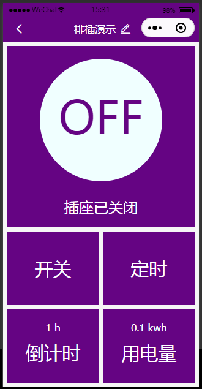

[English](README.md) | [中文版](README_cn.md)

This project is developed using Tuya SDK, which enables you to quickly develop branded apps connecting and controlling smart scenarios of many devices.
For more information, please check Tuya Developer Website.

# 涂鸦电插小程序

- 这个微信小程序用来查看涂鸦电插
- 在协议授权下你可以复制代码并随意修改
- demo sample:

- 开源协议 : MIT 协议

